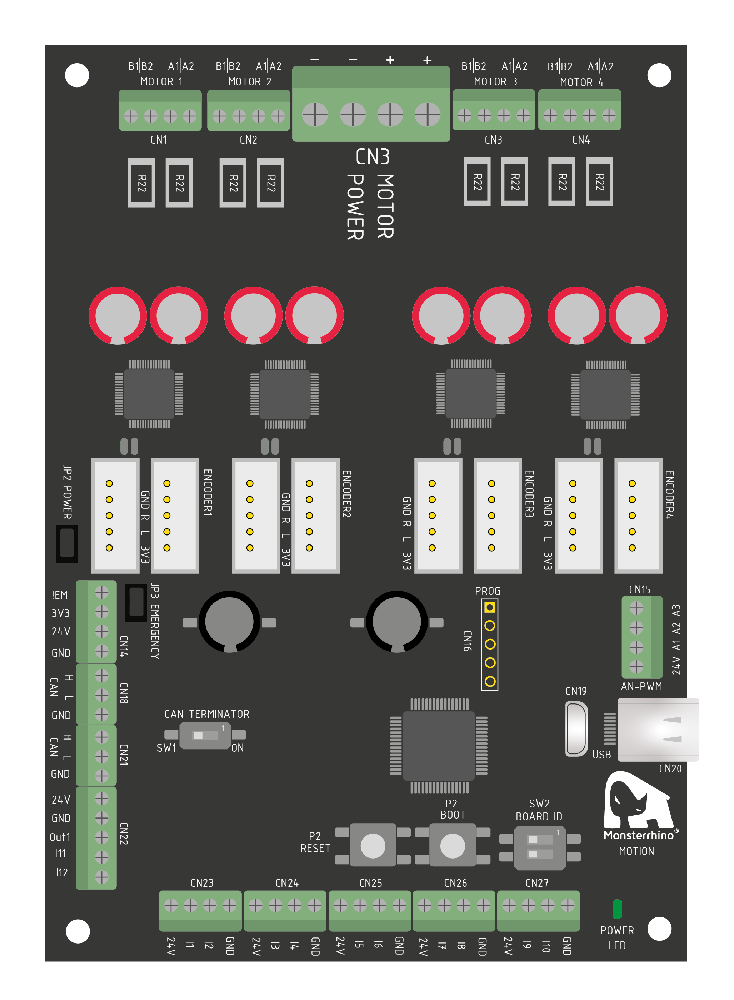
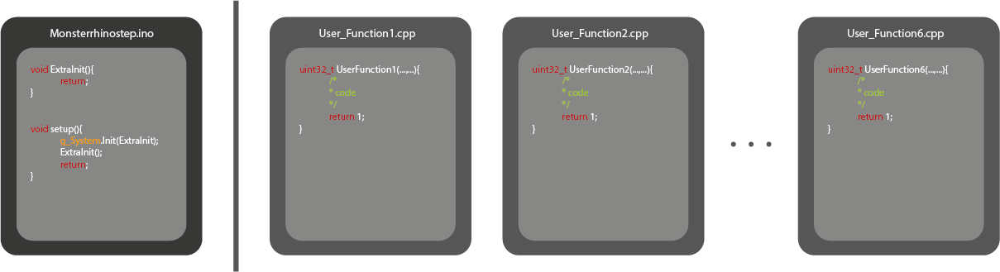
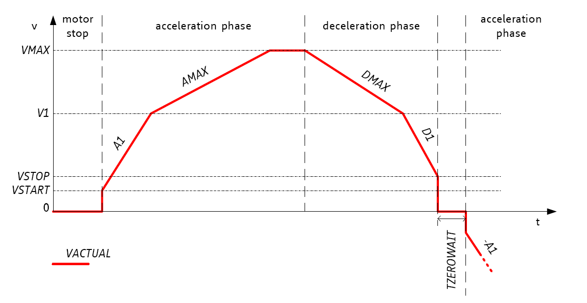

<!-- {width=20%} 

<p align="center">
  
</p>

<p align="center">
  
</p>
 -->


# General
**Monsterrhino Motion** is an independent stepper motor controller.  

The MonsterrhinoMotion card can be controlled via three different ways: over **predefined USB commands**, over **predefined CAN commands** or by **programming the MonsterrhinoMotion card directly** using the Monsterrhinostep-Lib for the ArduinoIDE. 

It can run up to 4 stepper motors at once - in parallel. The powerful MCU combined with our advanced firmware (multitasking capable - up to 6 user tasks) allows you to control stepper motors in the most simple way - you can program it with the Arduino IDE or with more advanced IDEs. Our firmware allows you to program the card at a high level e.g. you tell the motor to rotate continuously, make a 100 steps, etc. Further key features are limit switch connectors for each motor, encoder connectors, digital sensor inputs and digital/analog outputs. 
The CAN interface offers reliable high performance communication with other devices such as Monsterrhino Motion, Monsterrhino Control, Raspberry Pi, Arduino and many more.

Specification:  

- **4** Stepper motors
- **12** digital inputs
- **1** digital output
- **3** analog outputs
- **


# USB
UART is the simplest way to give commands. MonsterrhinoMotion can be controlled directly, out of the box, via UART-communication.  

Just open the serial command window and select the following settings and the COM-port of your MonsterrhinoMotion.  
After a successful connection with your MonsterrhinoMotion you can send commands as shown here:  
(**Attention:** Motion needs to be in normal mode **not** boot mode! Led is blinking)
```
m1tp 100  (Motor 1 target point 100 steps)
m3mr 200  (Motor 3 move relative 200 steps)
m2ma 100  (Motor 2 set motor current to 100mA)

m3ma ?    (Motor 3 returns motor current in mA)
m2cp ?    (MOtor 2 returns current position)
```
**Note:** A list of all UART-commands can be found in the documentation (~/Documentation).
# Communication
This board offers two main types of communication:  

* **Serial:** U(S)ART is used to communicate with lower speed.
* **CAN:**  CAN (common in automotive) is used to communicate faster and without failure.

## Serial U(S)ART

UART is the simplest way to give commands. MonsterrhinoMotion can be controlled directly, out of the box, via UART-communication.  

Just open the serial command window and select the following settings and the COM-port of your MonsterrhinoMotion.  
After a successful connection with your MonsterrhinoMotion you can send commands as shown here:  

Serial communication is possible via USB. The following properties should be set to ensure correct data transfer:

* U(S)ART support: generic 'Serial'
* Line ending: Both CR & LF
* Baud rate: 115200

The serial command is build as follows:  

function + Nr + subFunction (+optional: value/subFunction2 + value)

```
m1tp 100  (Motor 1 target point 100 steps)
m3mr 200  (Motor 3 move relative 200 steps)
m2ma 100  (Motor 2 set motor current to 100mA)

m3ma ?    (Motor 3 returns motor current in mA)
m2cp ?    (MOtor 2 returns current position)
```
**Attention:** Motion needs to be in normal mode **not** boot mode! Led is blinking


### Motor commands

function|subfunction1|subfunction1|subfunction2/value
-|--|---         |-----
m|tp  |targetpos         |(value) or (?)
m|cp  |currentpos        |(value) or (?)
m|rm  |rampmode          |v,p,h or (?)
m|ms  |maxspeed          |(value) or (?)
m|cs  |currentspeed      |(?)
m|r   |register          |Controller Register?
m|rs  |rampspeeds        |(3 values: start,stop,hold), (?) for more information
m|ac  |acceleration      |(value) for A1,Amax,D1,Dmax, (?) for more information
m|as  |accelerations(    |(5 values: A1,D1,hold,Amax,Dmax), (?) for more information
m|s   |stop              |(value) TODO: no output in serial and afterwards problems
m|en  |enable            |(value) or (?)
m|ep  |encoderposition   |TODO
m|lp  |latchedposition   |TODO
m|le  |latchedencoder    |TODO
m|mr  |moverelative      |(value)
m|mds |motordrvstatus    |(?), other functions to set/get drive status
m|mrs |motorrampstat     |(?), other functions to set/get ramp status
m|gs  |gstat             |(?), other functions
m|ma  |currentma         |(value) or (?)
m|fwm |freewheelingmode  |1,0 or (?)
m|mcs |modechangespeeds  |(3 values: pwmThrs, coolThrs, highThrs)
m|swm |swmode            |(?), other functions with value afterwards (s.a. LimitSW section)
m|cc  |coolconf          |(?), other functions
m|smp |savemotorparameter|-
m|iv  |icversion         |(?)
m|ld  |load              |default or defaultall TODO:?
m|st  |startup           |(?), other functions to set/get startup values
m|ho  |homing            |(?), other functions to set/get homing values
m|tsc |tunesteathchop    |-
m|tps |tunestallguard    |-

### Input commands

function|subfunction1|subfunction1|subfunction2
-|--|---         |-----  
i|if  |inputfunction     |
i|st  |startup           |

### System commands

function|subfunction1|subfunction1|subfunction2
-|--|---         |-----  
s|sv  |softwareversion   |(?)
s|hv  |hardwareversion   |(?)
s|do  |door              |TODO
s|bi  |bordid            |(?) according to SW2, binary [0-3]
s|ft  |firmwaredaytime   |(?) return compile time
s|st  |startup           |(?), other functions to set/get startup system values
s|pw  |pwm +[AnalogPort] |(value) [0-255]
s|pf  |pwmfrequency + [Aport]|(value)
s|sv  |save              |-
s|reset|reboot           |-
s|ca  |canadress         |(value)
s|cs  |canspeed          |(value)
s|ld  |load              |-
s|d   |debug             |-

### Userfunction commands

function|subfunction1|subfunction1|subfunction2
-|--|---         |-----  
f|s  |start   |(value)
f|t, b  |stop, break   |(value)
f|v  |variable  |(?)(value)
f|f  |float  |(?)(value)
f|st  |startup |(value)
f|u  |unlock |(value)


# Programming
It is possible to program various functions on the MonsterrhinoMotion, this enables a fully autonomous and dynamic system.  
The main structure of the code consists of six "UserFunction" files (User_Function1.cpp) and the main file ("monsterrhinostep.ino").  

The following image shows you the **main structure** of the files used to program the Motion:



**Note:** The loop function is **not used**, because all processes and actions are programmed in the "Userfunctions" that can be executed simultaneously.

## "monsterrhinostep.ino"-file
This file is used for main initialization.  
Example:
```C++
#include <Wire.h>
#include  "PortIni.h"

void ExtraInit()
{
	g_Input1.SetRunRisingFunction(INPUT_RUN_USERFUNCTION_START_2 + 1);
	//set Input1 interrupt at rising edge, Start userfunction 2 with parameter par=1
}
//------------------------------------------------------------------------------
void setup() {
	// Init IO
	g_System.Init(ExtraInit);
	ExtraInit();
}
```

## User Function
The six "UserFunction"-files can be programmed for any action. They can be started and stopped by inputs, CAN-commands, UART-commands or other userfunctions.  

```
Serial commands:
f1s1
//Start UserFunction1 with parameter par=1
f2s2
//Start UserFunction2 with parameter par=2 (even if function1 is not finished)
f1t
//Stop UserFunction1
```

Functions to start or stop other UserFunctions are:
  
```C++
TODO
```

## Motor control

### Motor setup
*(~/ExamplesCpp/Example1_MotorSetup.cpp)*

To run a stepper motor, first you need to set up the main motor parameters as motor current, speed, acceleration and others.
As you can see in the following code a task needs to start in one of the six "UserFunctions":  

```C++
void MotorInit()
{
	g_Motor1.LoadMotorParameter();		//Loads default motor values (SenseResitor, Current, ...)

	g_Motor1.SetMotorCurrent(100);		//Motor current in mA (0.001 Ampere)
	g_Motor1.SetMotorCurrentHold(50);	//Motor standstill current

	g_Motor1.Begin();					        				

	g_Motor1.ResetRampStatus();			  //Reset RampStatus flags and set ramp Speed/Acceleration to default
	g_Motor1.SetRampSpeeds(g_Motor1.GetStartup_RampSpeedsStart(), g_Motor1.GetStartup_RampSpeedsStop(), g_Motor1.GetStartup_RampSpeedsHold()); //Start, stop, threshold speeds
	g_Motor1.SetAccelerations(g_Motor1.GetStartup_AccelerationsAMax(), g_Motor1.GetStartup_AccelerationsDMax(), g_Motor1.GetStartup_AccelerationsA1(), g_Motor1.GetStartup_AccelerationsD1());
	
	return;
}

uint32_t UserFunction1(uint32_t par, UserFunction* pUserFunction)
{
  MotorInit(); //Motor initialization
  return 1;
}
```
In the following examples the function "MotorInit" is used but not shown.  

### Ramp behavior



According to the shown diagram you can adjust following parameters of the ramp behavior:  

* **Acceleration:** Start(A1) and Max(Amax)
* **Deceleration:** Final(D1) and Max(Dmax)
* **MaxSpeed:** From 0 to ?
* **RampSpeed:** Start, Stop, Hold  

```C++
g_Motor1.SetRampSpeeds(VSTART, VMAX, VHOLD)
```
An example to set these parameters from the EEBROM (with the startup values) is shown here.
```C++
g_Motor1.SetRampSpeeds(
g_Motor1.GetStartup_RampSpeedsStart(), g_Motor1.GetStartup_RampSpeedsStop(), g_Motor1.GetStartup_RampSpeedsHold()
); //V1,VMAX, VHOLD

g_Motor1.SetAccelerations(
g_Motor1.GetStartup_AccelerationsAMax(), g_Motor1.GetStartup_AccelerationsDMax(), g_Motor1.GetStartup_AccelerationsA1(), g_Motor1.GetStartup_AccelerationsD1()
); //AMAX, DMAX, A1, D1
```

**Note:** Value *Vstart* is default zero.  
**See also:** Serial [Motor commands] ramp mode (*m1rs,m1rc, m1as*)

Using following command you can set the three values (VSTART, VMAX, VHOLD) as equal value:
```C++
g_Motor2.SetMaxSpeed(V);
```


### Ramp mode
```C++
g_Motor1.SetRampMode(MotorClass::RampMode::POSITIONING_MODE);
g_Motor1.SetRampMode(MotorClass::RampMode::VELOCITY_MODE);
g_Motor1.SetRampMode(MotorClass::RampMode::HOLD_MODE);
```

There are three different ramp modes:  

* **[Positioning mode]:** Motor turns til it reached its target point.  
* **[Velocity mode]:** Motor velocity to max speed.
* **[Hold mode]:** Velocity remains unchanged, unless stop event occurs. 

**See also:** Serial [Motor commands] ramp mode (*m1rm (v,p,h or ?)*)

### Positioning mode

Set motor to positioning mode:
```C++
g_Motor1.SetRampMode(MotorClass::RampMode::POSITIONING_MODE);
```

This mode allows you to move a defined number of steps.

* **TargetPosition**: this mode moves to the given position e.g. if the motor is on position 100 and you set ``` g_Motor1.SetTargetPosition(-200.0);  ``` the motor will automatically move -300 steps to the position -200. If the motor is on position -100 and you set ``` g_Motor1.SetTargetPosition(-200.0);  ``` the motor will move -100 stepps.

* **MoveRelative**: this mode moves the motor indipendent of the current position e.g. if the motor is on position 100 an you set   ``` g_Motor2.SetMoveRelative(40);``` it will move to position 140. If you repeat the command again you will move to position 180.

#### Non blocking move
If it is intendet that the program continous while the motor moves to a given position you can simply use this commands: 
```C++
g_Motor1.SetTargetPosition(200.0);  
//Set target position to 200 steps (double value)
g_Motor1.SetMoveRelative(10.0);     
//Set target position 10 steps relative from current position
```

The same works also in negative direction:
```C++
g_Motor1.SetTargetPosition(-200.0);  
//Set target position to -200 steps (double value)
g_Motor1.SetMoveRelative(-10.0);     
//Set target position -10 steps relative from current position
```
#### Blocking move
If you want to pause your program until the movement of a motor has finished you can do that as follows:
```C++
g_Motor2.SetMoveRelative(40);
pUserFunction->m_MotorIoEvent.SetOrCondition(MOTORIOEVENT_MOTOR2PosReached);  // waits until the target position has reached 
if (pUserFunction->WaitEvent() == USERFUNCTIONEVENT_EXIT) return false;       // waits until the target position has reached
```
This also works with moving to an absolute position:
```C++
g_Motor2.SetTargetPosition(-200.0);
pUserFunction->m_MotorIoEvent.SetOrCondition(MOTORIOEVENT_MOTOR2PosReached);  // waits until the target position has reached 
if (pUserFunction->WaitEvent() == USERFUNCTIONEVENT_EXIT) return false;       // waits until the target position has reached
```
However for going to an absolute position you can also use the one-liner:
```C++
if (pUserFunction->SetTargetPosition_MotorWait(g_Motor2, -30.0f) == USERFUNCTIONEVENT_EXIT) return false;
```


### Velocity mode  
In this mode the motor turns with the maximum speed.
```C++
g_Motor1.SetRampMode(MotorClass::RampMode::VELOCITY_MODE);
//Set ramp mode to "VelocityMode"
g_Motor1.SetMaxSpeed(100);
//Set maximum speed to 100 steps/sec
```

**Note:** When changed to this mode, max speed is zero. To begin set **max speed** to a value greather than 0.  

### Move to sensor

Sometimes you want to move a motor until you get a signal from a sensor or switch (like when you do homing), but afterwards you want to ignore the sensor signal (and cross the sensor) you can do that with following lines of code (moves motor 2 until the input 1 is pulled down):


```C++
g_Motor2.SetMaxSpeed(100);
g_Motor2.SetTargetPosition(10000);
pUserFunction->m_MotorIoEvent.SetOrCondition(MOTORIOEVENT_INPUT1_RisingHigh);
if (pUserFunction->WaitEvent() == USERFUNCTIONEVENT_EXIT) return false;
  
g_Motor2.SetCurrentPosition(0.0f);
g_Motor2.SetTargetPosition(0.0f);

```


### Motor stall detection

The MonsterrhinoMotion card can detect **motor stall** by measuring the back EMF (electro magnetic force) of the stepper motor. This is a useful feature for certain applications such as colaborative robots. Our library makes it relatively simple to implement this feature into your application, following function starts motor 1 with in the stall detection mode: 

```C++
uint32_t RunStallGuard(UserFunction *pUserFunction){
   
    g_Motor1.SetRampMode(MotorClass::VELOCITY_MODE);
    TMC5160_Reg::COOLCONF_Register coolconf = g_Motor1.GetCOOLCONF();
    TMC5160_Reg::SW_MODE_Register swMode = g_Motor1.GetSW_Mode();
    g_Motor1.SetMaxSpeed(run_speed);
    g_Motor1.SetModeChangeSpeeds(0, 50, 0);
    coolconf.sgt = 5; // Value from -64 .. 63. This value needs to be adjusted acording to your desired motor stop point 
    g_Motor1.SetCOOLCONF(coolconf);
    swMode.sg_stop = 1;
    vTaskDelay(1000);
    g_Motor1.SetSW_Mode(swMode);
    Serial.println("SG Active Left!");
   
    return 1;
  
}

```
The correct operation depends on the setting of the ```coolconf.sgt ``` factor, motor current setting, and motor speed setting. This settings have to be tuned for a correct functioning of this feature. The motor stall feature works only with ```SetRampMode(MotorClass::VELOCITY_MODE)```, due to the need of a steady motion of the motor in order to measure the back EMF.


The relative force measured on the stepper motor can be requested using following function:  

```C++
uint32_t TuneStallGuard2View(UserFunction *pUserFunction)
{

      TMC5160_Reg::DRV_STATUS_Register drvStatus = { 0 };
      drvStatus = g_Motor1.GetDrvStatus();
      
      return drvStatus.sg_result;
}

```
A fully working example of this function can be found here: https://github.com/Monsterrhino/MonsterrhinoMotion/tree/master/Documentation/ExampleCpps/DetectMotorStall

Simply open your ArduinoIDE and go to **Files->Examples->Monsterrhinostep->monsterrhinostep** and open the library example. Copy and past the content of **monsterrhinostep**, **User_Function1**, and **User_Function2** of the DetectMotorStall example to the acording files in your ArduinoIDE, compile and upload to the MonsterrhinoMotion card and enjoy.

### Hold mode

In this mode velocity remains unchanged, unless a stop event occurs.
If you change velocity after ramp mode was set to hold mode nothing happens.

Set motor to positioning mode:
```C++
g_Motor1.SetRampMode(MotorClass::RampMode::HOLD_MODE);
```

## Startup parameters

Motors have many values that are set default after reset.  
These values can be set with serial [Motor commands] or in the code. After you change one of the startup values you need to save the parameters with the serial command "s save".  
The command "m1st ?" returns a list of all parameters.

```
Serial commands:
m1st sr 100   
//Set motor1 startup value of senseResisor to 100 Ohm
s save        //System save
```

In the following list you can find all motor startup values. They can be read or set with these two functions:
**SetStartup_** or **GetStartup_**  
```C++
g_Motor1.SetStartup_SenseResistor(200);
//Set startup value for motor1 senseResistor to 200 Ohms
```

Function|Description
---|------
drvStrength           |
bbmTime               |
bbmClks               |
SenseResistor         |Resistor for current measuring in mOhm
MotorCurrent          |Motor current in mA
MotorCurrentReduction |
Freewheeling          |Reduce motor current to 0mA in standstill
Iholddelay            |
PwmofsInitial         |
PwmGradInitial        |
StepperDirection      |Direction of stepper motor
MotorSteps            |Full steps of stepper motor
PWMThrsInt            |
PWMThrs               |
COOLThrsInt           |
COOLThrs              |
HighThrs              |
HighThrsInt           |
SWMode                |see [Limit switch]
RampMode              |see [Ramp mode]
RampMaxSpeed          |Vmax ([Ramp behavior])
RampMaxSpeedInt       |Vmax integer ([Ramp behavior])
RampSpeedsStartInt    |Vstart integer ([Ramp behavior])
RampSpeedsStart       |Vstart ([Ramp behavior])
RampSpeedsHoldInt     |V1 integer ([Ramp behavior])
RampSpeedsHold        |V1 ([Ramp behavior])
RampSpeedsStopInt     |Vstop integer ([Ramp behavior])
RampSpeedsStop        |Vstop ([Ramp behavior])
AccelerationsAMaxInt  |Maximal acceleration integer
AccelerationsAMax     |Maximal acceleration
AccelerationsDMaxInt  |Maximal deceleration integer
AccelerationsDMax     |Maximal deceleration
AccelerationsA1Int    |Initial acceleration integer
AccelerationsA1       |Initial acceleration
AccelerationsD1Int    |Initial deceleration integer
AccelerationsD1       |Initial deceleration
HomingMode            |See parameter "mode" in [Homing]
HomingOffsetInt       |Homing offset integer
HomingOffset          |Homing offset
HomingMaxPos          |Homing max. position
HomingTimeout         |Homing timeout
HomingSpeed2Int       |Homing speed second contact integer
HomingSpeed2          |Homing speed second contact
HomingDmaxInt         |Homing max deceleration integer
HomingDmax            |Homing max deceleration
COOLCONF              |
                      |
EncoderResolution     |
EncoderAlloweddeviation|
EncoderSetup          |
EncoderInverted       |

## Limit switch


It is possible to use various types for limit sensing:  

* **Limit switch:** Two limit switches per motor, can be of any type (mechanical, inductive, ...).  
Connection through the corresponding JST-XH connector CN[6,8,10,12] (for Motor 1,2,3,4)  
* **Sensorless:** The motor stops at a set force on the motor shaft.

Properties for motor limit switch configuration are set with following parameters:  

* **stop_l_enable:**  Enable automatic motor stop during active left reference switch input
* **stop_r_enable:**  Enable automatic motor stop during active right reference switch input
* **pol_stop_l:** Sets the active polarity of the left reference switch input (1=inverted, low active, a low level on REFL stops the motor)
* **pol_stop_r:** Sets the active polarity of the right reference switch input (1=inverted, low active, a low level on REFR stops the motor
* **swap_lr:**  Swap the left and the right reference switch inputs
* **latch_l_inactive:** Activate latching of the position to XLATCH upon an inactive going edge on REFL
* **latch_r_inactive:** Activate latching of the position to XLATCH upon an inactive going edge on REFR
* **latch_l_active:** Activate latching of the position to XLATCH upon an active going edge on REFL
* **latch_r_active:** Activate latching of the position to XLATCH upon an active going edge on REFR
* **en_latch_encoder:** Latch encoder position to ENC_LATCH upon reference switch event
* **sg_stop:** Enable stop by stallGuard2 (also available in dcStep mode). Disable to release motor after stop event.
* **en_softstop:** Enable soft stop upon a stop event (uses the deceleration ramp settings)

Example:  
```
Serial commands:
m1swm sle 1   
//Motor1 stop left enable
m1swm sre 1   
//Motor1 stop right enable
m1tp 10000
//Motor turns to targetPos 10000
//if the right limit switch is activated the motor stops (position not reached!)
```
or  
```C++
TMC5160_Reg::SW_MODE_Register swMode;
swMode.stop_l_enable = 1;
//stop left enable
swMode.stop_r_enable = 1;
//stop right enable
g_Motor1.SetSW_Mode(swMode);
//set selected options for motor1 swMode

g_Motor1.SetTargetPosition(1000);
//Set target position to 1000
```

## Special functions  

Special functions are stall guard, coolStepping, power stage tuning and stealth chop.

### Events
Events provide the machine to react on different actions depending on motor status, user function status, input status and time.  

#### SetOrCondition
This function waits until one (or one of multiple conditions is satisfied) condition is satisfied. 
```C++
g_Motor1.ResetRampStatus();

pUserFunction->m_MotorIoEvent.SetOrCondition(MOTORIOEVENT_MOTOR1PosReached);
if (pUserFunction->WaitEvent() == USERFUNCTIONEVENT_EXIT) return false;
```
of multple conditions: 
```C++
g_Motor1.ResetRampStatus();
g_Motor4.ResetRampStatus();

pUserFunction->m_MotorIoEvent.SetOrCondition(MOTORIOEVENT_MOTOR1PosReached | MOTORIOEVENT_MOTOR4PosReached);
if (pUserFunction->WaitEvent() == USERFUNCTIONEVENT_EXIT) return false;
```

The ```g_Motor2.ResetRampStatus();``` is necessary to clear the event status. 

#### SetAndCondition
This function waits until all given conditions are satisified.
```C++
g_Motor3.ResetRampStatus();

pUserFunction->m_MotorIoEvent.SetAndCondition(MOTORIOEVENT_MOTOR3PosReached);
if (pUserFunction->WaitEvent() == USERFUNCTIONEVENT_EXIT) return false;
```
of multple conditions: 
 
```C++
g_Motor3.ResetRampStatus();
g_Motor4.ResetRampStatus();

pUserFunction->m_MotorIoEvent.SetAndCondition(MOTORIOEVENT_MOTOR3PosReached | MOTORIOEVENT_MOTOR4PosReached);
if (pUserFunction->WaitEvent() == USERFUNCTIONEVENT_EXIT) return false;
```

The ```g_Motor2.ResetRampStatus();``` is necessary to clear the event status. 
 
## Homing


Homing has four main steps:  

1) **First contact** with limit switch  
2) Get **safety distance**: Go away 50 steps from first contact (with changed direction)  
3) **Second contact** with **slower** speed (*rampSpeed_2*)  
4) **Offset** after second contact (*homingOffset*, with changed direction)  

Homing can be configured with the following parameters:  

```C++
g_Motor1.m_HomingParameters.mode = 1;
g_Motor1.m_HomingParameters.rampSpeedHold = 200.0;
g_Motor1.m_HomingParameters.homingOffset = 15.0;
```  
* **mode:** homing on the **left (1)** or **right (2)** side or **both sides (3)**. 0 is homing off.
* **timeOut:** Timeout without successful homing
* **maxPos:** Maximal position without successful homing  (in microsteps)
* **rampSpeed:** Initial speed in homing (step 1); default is Default_Startup_MaxSpeed
* **rampSpeed_2:** Speed in step 3: second contact
* **homingOffset:** Offset from actual switch position
* **rampSpeedStart:** 
* **rampSpeedStop:**  
* **rampSpeedHold:**  
* **accelerationsAmax:** Maximum acceleration
* **accelerationsDmax:**  Maximum deceleration
* **accelerationsA1:**  Start acceleration
* **accelerationsD1:**  Finish deceleration

**Note:**  
In step 2, if switch is still pressed after 50 steps, this step will repeat.  
In step 3, motor turns 100 steps til it reaches the limit switch, otherwise there is a homing error.
The motor gets set in POSITIONING MODE when homing. 
Step 4 speed is startup_maxSpeed.


### Normal homing
When setting the "MOTOR_FUNCTION_HOMING" start-trigger, the motor begins homing with the **pre-selected** parameters.  
The next command is to keep the motor locked until the homing event is finished.  

```C++
g_Motor3.MotorFunction_TiggerStart(MOTOR_FUNCTION_HOMING);
pUserFunction->MotorHomingOk(LOCK_MOTOR3, par);
```


### Parallel homing

It is possible to home multipe axis in parallel or simultaneously. Following code homes for example **Motor1** and **Motor2**:

```C++
g_Motor1.ResetRampStatus();   // Resets the limit switch register
g_Motor2.ResetRampStatus();   

g_Motor1.MotorFunction_TiggerStart(MOTOR_FUNCTION_HOMING);    // Starts homing on motor1
g_Motor2.MotorFunction_TiggerStart(MOTOR_FUNCTION_HOMING);    // Starts homing on motor2

pUserFunction->MotorHomingOk(LOCK_MOTOR1 | LOCK_MOTOR2, par);   // Waits for motor 1 und motor 2 to finish homing
```

This methodology allows to home all four axis of the MonsterrhinoMotion card in parallel. An example of multiple axis homing can be seen here: 

https://www.youtube.com/channel/UCkQM9dfGWviW-XfwOgTvgYg


### Sensorless homing
It is also possible to home without limit switches using the motor stall detection feature. Example code is provided in the section **Motor stall detection**. The function 
is presented in following video:  

https://www.youtube.com/watch?v=vMpDnNlyOfQ


## Input
  
**Interrupts** are used to perform an action when the selected input is triggered, either on the **falling** or **rising** edge.  
The following function can be coded in the **ExtraInit-Function** (monsterrhinostep.ino). In this case the interrupt is activated after a reset.

```C++
g_Input1.SetRunFallingFunction(INPUT_RUN_MOTOR_STOP_1);
```
**Actions:**
These are the defined values for an action, beginning with **INPUT_RUN_**:  
  
- NONE  
- USERFUNCTION_START_*[UserFunctionNr]* + *[SubFunctionNr]*  
- USERFUNCTION_STOP_*[UserFunctionNr]*  +	*[SubFunctionNr]*  
- MOTOR_STOP_[MOTOR_NR]  
- MOTOR_EMERGENCYSTOP_[MOTOR_NR] 
    
**Note:** All combinations are possible when using a motor action.  
 
```C++
g_Input1.SetRunFallingFunction(INPUT_RUN_MOTOR_STOP_1);
//Stop motor 1 at falling edge on input 1

g_Input2.SetRunRisingFunction(INPUT_RUN_MOTOR_STOP_2_3_4);
//Stop motor 2,3 and 4 at rising edge on input 2

g_Input3.SetRunRisingFunction(INPUT_RUN_MOTOR_STOP_1_2_3_4);
//Stop motor 1,2,3 and 4 at rising edge on input 3

g_Input4.SetRunFallingFunction(INPUT_RUN_USERFUNCTION_1 + 2); 
//Start user function 1 sub 2 (parameter Par=2) at falling edge on input 4
```  
The state of an input can also be read with the digitalRead-function.  
```C++
if(digitalRead(g_Input1)==1){
  Serial.print("Hello world");
}
```
Example:

```C++
//FILE "monsterrhinostep.ino":
void ExtraInit(){
  g_Input1.SetRunFallingFunction(INPUT_RUN_MOTOR_STOP_1);
  g_Motor1.SetTargetPosition(1000);
  return;
}

//FILE "User_Function1.cpp":
uint32_t UserFunction1(uint32_t par, UserFunction* pUserFunction)
  g_Motor1.SetTargetPosition(0);
  return 1;
}

```
**see also:** [Input commands]


## CAN

CAN is a commonly used communication system in automotive, automation and others.  
Due to its high reliability and higher speed than UART it can be used to communicate with the Motion from another Motion or, as an example, a RaspberryPi or Arduino (with their CAN-module).  

Up to 4 Monsterrhino boards can be connected via CAN to communicate with each other. It is also possible to connect other devices that support CAN communication.  

CAN functions can be used in user functions as following:  

```c++
pUserFunction->RemoteCommand_Motor_SetTargetPosition(3, 1, 200);
//Set target position of motor 1 on board with address 3 to value 200
//address: 3; motorNr:1; Value:200

pUserFunction->RemoteCommand_UserFunction_SetStart(2, 2, 1);
//Start user function 2 sub function 2 on board with address 2
//address: 2; functionNr:2; subFunction:1

uint32_t testVariable = 0;
pUserFunction->RemoteCommand_UserFunction_GetVariable(4, 1, 5, testVariable);
//Get user function variable 5 of user function 1 on board with address 4 and write to testVariable
//address: 5; functionNr:1; functionVar:5; testVariable: variable with return value
```
The remoteCommand function supports all serial command functions.  
In addition you can get and set **user function variables** via remoteCommand as shown above.

### Board setup for CAN  

Switch 1 (SW1, CAN TERM) activates CAN termination resistor (120 Ohm) (1 is active).  
Switch 2 (SW2, BOARD ID) indicates CAN address (BoardID+2) as follows:

SW2_1     |SW2_2    |Address|Board ID
-----|------|------|-----
LOW   |LOW  |   2  |0
HIGH  |LOW  |   3  |1
LOW   |HIGH |   4  |2
HIGH  |HIGH |   5  |3

**Note**:  
Address 0 is reserved for a broadcast message.  
Address 1 is reserved for other devices.  

## Variables
Each [User Function] has a total of **12 public variables** with two types (uint32, double) each 6.  These variables have the ability to be read and/or be set over CAN communication.  
This variables can be used in CAN-communication.
```C++
pUserFunction->m_variable[0] = 0; //m_variable[0]=0 of current UserFunction
pUserFunction->m_variableFloat[4] = 3.45;
```
**Note:** *m_variable[6]* is **no** variable because each Userfunction offers six of each type.  
0-5 equals a total of 6.


# CAN 

## CAN bus communication protocol

### How to compose a CAN message for the MonsterrhinoMotion card
Commands can also be send over the CAN bus, therefore it is necessary to set the correct bits in the CAN frame.Following a description of the bits within the CAN frame.

	21-28 ID  (8 Bit 0-255 0=broadcast 1-9 Bus controller )
	15-20 Function (6 Bit )
	9-14 Nr (6 Bit )
	2-8  Sub Function (7 Bit)
	1   RTR respond
	
	Implementation protocol V2:
	-Addressing
		  - Used frame format is extended (29 bit) Address 0-536.870.911
			- Bit 0-3 Nummer (0-15)
			- Bit 4-13	sub command (9 bit =512)	    ;select sub command
			- Bit 14-17	command (0-15)					;command
				0 ('s')									;Sytem
				1 ('m')									;Motor
				2 ('i')									;Input
				3 ('f')									;User function
			- Bit 18	error						; active low
			-Bit 19-23	to Address
				0										;is a Broadcast message				
				2-31									;to Address
			-Bit 24-28	from Address
				0										;Bus controller
				2-31									;from Address
			- Bit 29	dentifies respond message
				0										;respond message
				1										;send message
			- Address range:
				Address 0 = broadcast message
				Address 1 = Bus controller
				available address range for client is 2-31

		

	-Data Field
		-Byte MSB-0		user return function_ID (0-127)
						Bit 0-7 (0-127)					;return function_ID
						Bit 7							; Set 1 = Get Value
		-Byte MSB-1 & MSB-7 <Data>		;length and type depending on the register

	


		- subCommand of motor command
			0;	emergency stop
				-no data
			1;	stop
				-no data
			2;	enable/disable driver
				-data type <byte>
					0:disabel driver
					1:enable driver
			3;  RampMode (uint8) <Set><Get>											RampMode
				-data type <uint8>
					0:																Positioning mode (using all A, D and V parameters)
					1:																Velocity mode to positive VMAX (using AMAX acceleration)
					2:																Velocity mode to negative VMAX (using AMAX acceleration)
					3:																Hold mode (velocity remains unchanged,unless stop event occurs)
			4;	TargetPosition (int48) <Set><Get>									the target position (step*1000) /!\ Set all other motion profile parameters before
				-data type <double*1000>
			5;	TargetPosition Register (int32) <Set><Get>							the target position (micro steps) /!\ Set all other motion profile parameters before
				-data type <int32>
			6;	MoveRelative(int32) <Set>											Move motor relative (steps*1000)
				-data type <double*1000>
			7;	MoveRelative Register(int32) <Set>									Move motor relative (micro steps)
				-data type <int32>
			8;	CurrentPosition (int48) <Set><Get>					 				the current internal position (steps*1000)
				-data type <double*1000>
			9;	CurrentPosition Register (int32) <Set><Get>					 		the current internal position (micro steps)
				-data type <micro steps>
			10;	Max Speed (uint32) <Set>											the max speed VMAX
				-data type <float*1000>
			11;	Max Speed Register (uint32) <Set><Get>								Register max speed VMAX
				-data type <uint32>
			12; Ramp speed Start(uint32) <Set><Get>									the start ramp speed
				-data type <float*1000>
			13;	Ramp speed Start Register (uint32) <Set><Get>						Register Ramp speed Start
				-data type <uint32>
			14; Ramp speed Stop(uint32) <Set><Get>									the stop ramp speed
				-data type <float*1000>
			15;	Ramp speed Stop Register (uint32) <Set><Get>						Register Ramp speed Stop
				-data type <uint32>
			16; Ramp speed Hold(uint32) <Set><Get>									the hold ramp speed
				-data type <float*1000>
			17;	Ramp speed Hold Register (uint32) <Set><Get>						Register Ramp speed Hold
				-data type <uint32>
			18;	get Current Speed(uint32)	<Get>									Return the current speed
				-data type <float*1000>
			19;	get Current Speed Register (uint32) <Get>							Return the current  speed Register 
				-data type <uint32>
			20; Acceleration AMAX(uint32) <Set><Get>								 ramp accelerations AMAX
				-data type <float*1000>
			21;	 Acceleration AMAX Register(uint32) <Set><Get>						Register  Acceleration AMAX
				-data type <uint32>
			22; Acceleration DMAX (uint32) <Set><Get>								ramp accelerations DMAX
				-data type <float*1000>
			23;	 Acceleration DMAX Register(uint32) <Set><Get>						Register  Acceleration DMAX
				-data type <uint32>
			24; Acceleration A1(uint32) <Set><Get>									ramp accelerations A1
				-data type <float*1000>
			25;	 Acceleration A1 Register(uint32) <Set><Get>						Register  Acceleration A1
				-data type <uint32>
			26; Acceleration D1(uint32) <Set><Get>									ramp accelerations D1
				-data type <float*1000>
			27;	 Acceleration D1 Register(uint32) <Set><Get>						Register  Acceleration D1
				-data type <uint32>
			28; ModeChangeSpeeds pwmThrs(uint32) <Set><Get>							mode change speeds pwmThrs
				-data type <float*1000>
			28;	 ModeChangeSpeeds pwmThrs Register(uint32) <Set><Get>				Register  ModeChangeSpeeds pwmThrs
				-data type <uint32>
			30; ModeChangeSpeeds coolThrs(uint32) <Set><Get>						mode change speeds coolThrs
				-data type <float*1000>
			21;	 ModeChangeSpeeds coolThrs Register(uint32) <Set><Get>				Register ModeChangeSpeeds coolThrs
				-data type <uint32>
			32; ModeChangeSpeeds highThrs(uint32) <Set><Get>						mode change speeds highThrs
				-data type <float*1000>
			33;	 ModeChangeSpeeds highThrs Register(uint32) <Set><Get>				Register ModeChangeSpeeds highThrs
				-data type <uint32>
			34;	Encoder Position (int48) <Set><Get>									the current encoder position (micro steps)
				-data type <double*1000>
			35;	Encoder Position Register(uint32) <Set><Get>						the current encoder position (steps*1000)
				-data type <uint32>
			36;	Latched Position (int48) <Set><Get>									the current latched position (micro steps)
				-data type <double*1000>
			37;	Latched Position Register(uint32) <Set><Get>						the Latched position (steps*1000)
				-data type <uint32>
			38;	LatchedEncoderPosition (int48) <Set><Get>							the current latched encoder position (steps*1000)
				-data type <double*1000>
			39;	LatchedEncoderPosition Register(int32) <Set><Get>					the current latched encoder position (uSteps)
				-data type <int32>


			50;	EncoderResolution_motorSteps (int32) <Set><Get>						the number of steps per turn for the motor
				-data type <int32>
			51;	EncoderResolution_encResolution (int32) <Set><Get>					the actual encoder resolution (pulses per turn)
				-data type <int32>
			
			53;	EncoderIndexConfiguration (uint8 bit bit bit bit ) <Set>			Configure the encoder N event context.
				-data type <uint8>													sensitivity : set to one of ENCODER_N_NO_EDGE, ENCODER_N_RISING_EDGE, ENCODER_N_FALLING_EDGE, ENCODER_N_BOTH_EDGES
				-data type <bit>													nActiveHigh : choose N signal polarity (true for active high)
				-data type <bit>													ignorePol : if true, ignore A and B polarities to validate a N event
				-data type <bit>													aActiveHigh : choose A signal polarity (true for active high) to validate a N event
				-data type <bit>													bActiveHigh : choose B signal polarity (true for active high) to validate a N event
				-data type <bit>
			54;	EncoderLatching(uint8) <Set>										Enable/disable encoder and position latching on each encoder N event (on each revolution)
				-data type <uint8>
			55;	isEncoderDeviationDetected(uint8) <Get>								Check if a deviation between internal pos and encoder has been detected
				-data type <uint8>
			56; clearEncoderDeviationFlag() <Set>									Clear encoder deviation flag (deviation condition must be handled before)
				-no data
			57; EncoderAllowedDeviation (int32) <Set>								Encoder Allowed Deviation
				-data type <uint32>
			58; SW_Mode (uint16) <Set><Get>											Reference Switch & StallGuard2 Event Configuration Register; See the TMC 5160 datasheet page 43
				-data type <uint16>
			59; DRV STATUS(uint32) <Get>											StallGuard2 Value and Driver Error Flags; datasheet page 56
				-data type <uint32>
			60; GetRampStatus(uint16) <Get><Reset>									RAMP_STAT � Ramp & Reference Switch Status Register; datasheet page 44
				-data type <uint16>
			61; GetGstat(uint8) <Get><Reset>										Global status flags
				-data type <uint8>


			67; SenseResistor(uint16) <Set><Get>									sense Resistor in mOhms 0=automatic
					-data type <uint16>
			68; MotorCurrent(uint16) <Set><Get>										Motor Current in mA
					-data type <uint16>
			69; MotorCurrentReduction(uint16) <Set><Get>							Motor current reduction in mA
					-data type <uint16>
			70; Motor Freewheeling Mode(uint8) <Set><Get>							Motor freewheeling mode
					-data type <uint8>
						FREEWHEEL_NORMAL   = 0x00,									Normal operation
						FREEWHEEL_ENABLED  = 0x01,									Freewheeling
						FREEWHEEL_SHORT_LS = 0x02,									Coil shorted using LS drivers
						FREEWHEEL_SHORT_HS = 0x03									Coil shorted using HS drivers
			71; Iholddelay(uint8) <Set><Get>										Controls the number of clock cycles for motor power down after a motion as soon as standstill is
																					detected (stst=1) and TPOWERDOWN has expired.The smooth transition avoids a motor jerk upon power down.
						-data type <uint8>
							0:														instant power down
							1..15:													Delay per current reduction step in multiple	of 2^18 clocks
			72; PWM_OFS(uint8) <Set><Get>											user defined PWM amplitude offset (0-255) related to full
						-data type <uint8>
																					motor current (CS_ACTUAL=31) in stand still.(Reset default=30)
			73; PWM_GRAD(uint8) <Set><Get>											Velocity dependent gradient for PWM amplitude: PWM_GRAD * 256 / TSTEP
																					This value is added to PWM_AMPL to compensate for	the velocity-dependent motor back-EMF.
						-data type <uint8>
			74; StepperDirection(uint8) <Set><Get>									Velocity motor  Stepper Direction
						-data type <uint8>

			75; UnLook Motor(uint8) <Set><Get>										Unlock Motor
				-data type <uint8>	
																This value is added to PWM_AMPL to compensate for	the velocity-dependent motor back-EMF.


			90; Homing Mode(uint8) <Set/Start><Get>									Start homing
						-data type <uint8>
							1: // endswitsh left
							2: // endswitsh right
			91; Homing timeOut (uint32) <Set><Get>									homing time to fail
						-data type <uint32>
			92; Homing maxPos (uint32) <Set><Get>									maximal deviation Posipion to fail
						-data type <uint32>
			93; Homing rampSpeed (uint32) <Set><Get>								rampSpeed for the homing process
						-data type <float*1000>
			94; Homing rampSpeed Register (uint32) <Set><Get>						Register rampSpeed for the homing process
						-data type <uint32>
			95; Homing rampSpeed_2(uint32) <Set><Get>								rampSpeed phase 2
						-data type <float*1000>
			96; Homing rampSpeed_2 Register (uint32) <Set><Get>						Register rampSpeed_2 for the homing process phase 2
						-data type <uint32>
			97; Homing Offset(uint48) <Set><Get>									homing offset(microstep)
						-data type <float*1000>
			98; Homing Offset Register (uint32) <Set><Get>							Register homing offset(microstep)
						-data type <uint32>
			99; Homing rampSpeedStart(uint32) <Set><Get>							homing ramp speed start
						-data type <double*1000>
			100; Homing rampSpeedStart Register (uint32) <Set><Get>					Register rampSpeedStart()
						-data type <uint32>
			101; Homing rampSpeedStop(uint32) <Set><Get>							homing ramp speed stop
						-data type <float*1000>
			102; Homing rampSpeedStop Register (uint32) <Set><Get>					Register rampSpeedStop()
						-data type <uint32>
			103; Homing rampSpeedHold(uint32) <Set><Get>							homing ramp speed hold
						-data type <float*1000>
			104; Homing rampSpeedHold Register (uint32) <Set><Get>					Register rampSpeedHold()
						-data type <uint32>
			105; Homing accelerationsAmax(uint32) <Set><Get>						homing accelerations Amax
						-data type <float*1000>
			106; Homing accelerationsAmax Register (uint32) <Set><Get>				Register accelerationsAmax()
						-data type <uint32>
			107; Homing accelerationsDmax(uint32) <Set><Get>			 			homing accelerations Dmax
						-data type <float*1000>
			108; Homing accelerationsDmax Register (uint32) <Set><Get>				Register accelerationsDmax()
						-data type <uint32>
			109 ;Homing accelerationsA1(uint32) <Set><Get>							homing accelerations A1
						-data type <float*1000>
			110; Homing accelerationsA1 Register (uint32) <Set><Get>				Register accelerationsA1()
						-data type <uint32>
			111;Homing accelerationsD1(uint32) <Set><Get>			 				homing accelerations D1
						-data type <float*1000>
			112; Homing accelerationsD1 Register (uint32) <Set><Get>				Register accelerationsD1()
						-data type <uint32>
										

			128;Startup  drvStrength(uint32) <Set><Get>			 					Startup Selection of gate driver current. Adapts the gate driver current to the gate charge of the external MOSFETs.
				-data type <uint8>
					00: weak
					01: weak+TC (medium above OTPW level)
					10: medium
					11: strong
						
			129;Startup  bbmClks(uint32) <Set><Get>			 						Startup 0..15: Digital BBM time in clock cycles (typ. 83ns).The longer setting rules (BBMTIME vs. BBMCLKS).
					-data type <uint16>
						(Reset Default: OTP 4 or 2)
			130;Startup  bbmTime(uint32) <Set><Get>			 						Startup Break-Before make delay
				-data type <uint8>
					0=shortest (100ns) � 16 (200ns) � 24=longest (375ns)
					>24 not recommended, use BBMCLKS instead
			131;Startup  Iholddelay(uint8) <Set><Get>								Startup	Iholddelay
						-data type <uint8>
			132;Startup  SenseResistor(uint16) <Set><Get>							Startup sense resistor in mOhms 0=automatic
					-data type <uint16>
			133;Startup  MotorCurrent(uint16) <Set><Get>							Startup motor current in mA
					-data type <uint16>
			134;Startup  MotorCurrentReduction(uint16) <Set><Get>					Startup motor current reduction in mA
					-data type <uint16>
			135;Startup  Motor Freewheeling Mode(uint8) <Set><Get>					Startup motor freewheeling mode
					-data type <uint8>
			136;Startup  PWM_OFS(uint8) <Set><Get>									Startup	user defined PWM amplitude offset (0-255) related to full
						-data type <uint8>
			137;Startup  PWM_GRAD(uint8) <Set><Get>									Startup	Velocity dependent gradient for PWM amplitude: PWM_GRAD * 256 / TSTEP
						-data type <uint8>
			138;Startup  StepperDirection(uint8) <Set><Get>							Startup	Velocity motor  Stepper Directio
						-data type <uint8>
			139;Startup  MaxSpeed (uint32) <Set><Get>								Startup	the max speed VMAX
				-data type <float*1000>
			140;Startup  MaxSpeed Register (uint32) <Set><Get>						Register Startup  MaxSpeed
						-data type <uint32>
			141;Startup  StartRampSpeed(uint32) <Set><Get>							Startup	the start ramp speed
				-data type <float*1000>
			142;Startup  StartRampSpeed Register (uint32) <Set><Get>				Register Startup  start ramp speed
						-data type <uint32>
			143;Startup  StopRampSpeed(uint32) <Set><Get>							Startup	the stop ramp speed
				-data type <float*1000>
			144;Startup  StopRampSpeed Register (uint32) <Set><Get>					Register Startup  stop ramp speed
						-data type <uint32>
			145;Startup  HoldRampSpeed(uint32) <Set><Get>							Startup	the hold ramp speed
				-data type <float*1000>
			146;Startup  HoldRampSpeed Register (uint32) <Set><Get>					Register Startup  hold ramp speed
					-data type <uint32>
			147;Startup  Acceleration maxAccel(uint32) <Set><Get>					Startup	ramp accelerations AMAX
				-data type <float*1000>
			148;Startup  Acceleration maxAccel Register (uint32) <Set><Get>			Register Startup  Acceleration maxAccel
					-data type <uint32>
			149;Startup  Acceleration maxDecel(uint32) <Set><Get>					Startup	ramp accelerations DMAX
				-data type <float*1000>
			150;Startup  Acceleration maxDecel Register (uint32) <Set><Get>			Register Startup  Acceleration maxDecel
					-data type <uint32>
			151;Startup  Acceleration startAccel(uint32) <Set><Get>					Startup	ramp accelerations A1
				-data type <uifloat*1000nt32>
			152;Startup  Acceleration startAccel Register (uint32) <Set><Get>		Register Startup  Acceleration startAccel
					-data type <uint32>
			153;Startup  Acceleration stopAccel(uint32) <Set><Get>					Startup	ramp accelerations D1
				-data type <float*1000>
			154;Startup  Acceleration stopAccel Register (uint32) <Set><Get>		Register Startup  Acceleration stopAccel
					-data type <uint32>
			155;Startup  ModeChangeSpeeds pwmThrs(uint32) <Set><Get>				Startup	mode change speeds pwmThrs
				-data type <float*1000>
			156;Startup  ModeChangeSpeeds pwmThrs Register (uint32) <Set><Get>		Register Startup  ModeChangeSpeeds pwmThrs
					-data type <uint32>
			157;Startup  ModeChangeSpeeds coolThrs(uint32) <Set><Get>				Startup	mode change speeds coolThrs
				-data type <float*1000>
			158;Startup  ModeChangeSpeeds coolThrs Register (uint32) <Set><Get>		Register Startup  ModeChangeSpeeds coolThrs
					-data type <uint32>
			159;Startup  ModeChangeSpeeds highThrs(uint32) <Set><Get>				Startup	mode change speeds highThrs
				-data type <float*1000>
			160;Startup  ModeChangeSpeeds highThrs Register (uint32) <Set><Get>		Register Startup  ModeChangeSpeeds highThrs
					-data type <uint32>
			161;Startup  EncoderResolution_motorSteps (int32) <Set><Get>		Startup	the number of steps per turn for the motor
				-data type <int32>
			162;Startup  EncoderResolution_encResolution (int32) <Set><Get>		Startup	the actual encoder resolution (pulses per turn)
				-data type <int32>
			
			164;Startup  EncoderIndexConfiguration (uint8 bit bit bit bit ) <Set><Get>		Startup	Configure the encoder N event context.
				-data type <uint8>													sensitivity : set to one of ENCODER_N_NO_EDGE, ENCODER_N_RISING_EDGE, ENCODER_N_FALLING_EDGE, ENCODER_N_BOTH_EDGES
				-data type <bit>													nActiveHigh : choose N signal polarity (true for active high)
				-data type <bit>													ignorePol : if true, ignore A and B polarities to validate a N event
				-data type <bit>													aActiveHigh : choose A signal polarity (true for active high) to validate a N event
				-data type <bit>													bActiveHigh : choose B signal polarity (true for active high) to validate a N event
				-data type <bit>													Startup	Enable/disable encoder and position latching on each encoder N event (on each revolution)
			
			166;Startup  EncoderAllowedDeviation (int32) <Set><Get>				Startup	Encoder Allowed Deviation
				-data type <uint32>
			167;Startup  SW_Mode (uint16) <Set><Get>							Startup	Reference Switch & StallGuard2 Event Configuration Register; See the TMC 5160 datasheet page 43
				-data type <uint16>
			168;Startup  RampMode (uint8) <Set><Get>							Startup	 RampMode
				-data type <uint8>
					0:															Positioning mode (using all A, D and V parameters)
					1:															Velocity mode to positive VMAX (using AMAX acceleration)
					2:															Velocity mode to negative VMAX (using AMAX acceleration)
					3:															Hold mode (velocity remains unchanged,unless stop event occurs)
				"HomingMode","HomingOffset","HomingMaxPos","HomingTimeout","HomingSpeed_2","HomingDmax"
			169;Startup  Homing Mode(uint8) <Set><Get>							Startup	homing mode
						-data type <uint8>
			170;Startup  Homing Offset(int48) <Set><Get>						Startup	homing offset(microstep)
						-data type <double*1000>
			171;Startup  Homing Offset Register (int32) <Set><Get>				Register Startup	homing offset(microstep)
						-data type <int32>
			172;Startup  Homing timeOut (uint32) <Set><Get>						Startup	homing time to fail
						-data type <uint32>
			173;Startup  Homing maxPos (int32) <Set><Get>						Startup	homing maximal deviation Posipion to fail
						-data type <int32>
			174;Startup  Homing rampSpeed_2(uint32) <Set><Get>					Startup	homing rampSpeed phase 2
						-data type <float*1000>
			175;Startup  Homing rampSpeed_2 Register (int32) <Set><Get>			Register homing Startup	rampSpeed_2
						-data type <int32>
			176;Startup  Homing accelerationsDmax(uint32) <Set><Get>			Startup	homing accelerations Dmax
						-data type <float*1000>
			175;Startup  Homing accelerationsDmax Register (int32) <Set><Get>	Register homing Startup	accelerationsDmax
						-data type <int32>
			512..768	Maping Motor Register
						-data type <int32/uint32>

			- subCommand of userFunction 
				1; start user function(uint8)  <Set><Get>							Start userFunction whith sub user function data
					-data type <uint8>
				2; stop user function
			   30; userFunctionVariable1(uint32)  <Set><Get>						Set/Get userFunction variable 1
			   31; userFunctionVariable2(uint32)  <Set><Get>						Set/Get userFunction variable 2
			   32; userFunctionVariable3(uint32)  <Set><Get>						Set/Get userFunction variable 3
			   33; userFunctionVariable4(uint32)  <Set><Get>						Set/Get userFunction variable 4
			   34; userFunctionVariable5(uint32)  <Set><Get>						Set/Get userFunction variable 5
			   35; userFunctionVariable6(uint32)  <Set><Get>						Set/Get userFunction variable 6
			   40; userFunction Variable1 float(uint48)(uint48/1000= double )  <Set><Get>					Set/Get userFunction float variable 1
			   41; userFunction Variable2 float(uint48)(uint48/1000= double )  <Set><Get>					Set/Get userFunction float variable 2
			   42; userFunction Variable3 float(uint48)(uint48/1000= double )  <Set><Get>					Set/Get userFunction float variable 3
			   43; userFunction Variable4 float(uint48)(uint48/1000= double )  <Set><Get>					Set/Get userFunction float variable 4

			   50; Startup  start user function(uint8)  <Set><Get>					Startup userFunction whith sub user function data

			   60; Startup userFunction Variable1(uint32)  <Set><Get>				Startup Set/Get userFunction variable 1
			   61; Startup userFunction Variable2(uint32)  <Set><Get>				Startup Set/Get userFunction variable 2
			   62; Startup userFunction Variable3(uint32)  <Set><Get>				Startup	Set/Get userFunction variable 3
			   63; Startup userFunction Variable4(uint32)  <Set><Get>				Startup	Set/Get userFunction variable 4
			   64; Startup userFunction Variable5(uint32)  <Set><Get>				Startup	Set/Get userFunction variable 5
			   65; Startup userFunction Variable6(uint32)  <Set><Get>				Startup	Set/Get userFunction variable 6
			   70; Startup userFunction Variable1 float(uint48)(uint48/1000= double )  <Set><Get>			Startup	Set/Get userFunction float variable 1
			   71; Startup userFunction Variable2 float(uint48)(uint48/1000= double )  <Set><Get>			Startup	Set/Get userFunction float variable 2
			   72; Startup userFunction Variable3 float(uint48)(uint48/1000= double )  <Set><Get>			Startup	Set/Get userFunction float variable 3
			   73; Startup userFunction Variable4 float(uint48)(uint48/1000= double )  <Set><Get>			Startup	Set/Get userFunction float variable 4

			- subCommand of input											<Input1..6 and laser1..2 >
				1 inputFaling(uint32)	<Set><Get>									Input Faling INPUT_RUN_USERFUNCTION
					-data type <uint32>
				2 inputRising(uint32)	<Set><Get>									Input Rising INPUT_RUN_USERFUNCTION
					-data type <uint32>
				3 Startup inputFaling(uint32)	<Set><Get>							Startup Input Faling INPUT_RUN_USERFUNCTION
					-data type <uint32>
				4 Startup inputRising(uint32)	<Set><Get>							Startup Input Rising INPUT_RUN_USERFUNCTION
					-data type <uint32>

				5 GetInputState <uint8><Get>										Get the state of input
					-data type <uint8>

				descipion of INPUT_RUN_USERFUNCTION:
				all fuctions can cominate 
				INPUT_RUN_USERFUNCTION_START_1						0x0001xx	; Start userfunction 1 whit sub function xx
				INPUT_RUN_USERFUNCTION_START_2						0x000200	; Start userfunction 2 whit sub function xx
				INPUT_RUN_USERFUNCTION_START_3						0x000400	; Start userfunction 3 whit sub function xx
				INPUT_RUN_USERFUNCTION_START_4						0x000800	; Start userfunction 4 whit sub function xx
				INPUT_RUN_USERFUNCTION_START_5						0x001000	; Start userfunction 4 whit sub function xx
				INPUT_RUN_USERFUNCTION_START_6						0x002000	; Start userfunction 4 whit sub function xx

				INPUT_RUN_USERFUNCTION_STOP_1						0x010100	; Stop userfunction 1
				INPUT_RUN_USERFUNCTION_STOP_2						0x010200	; Stop userfunction 2
				INPUT_RUN_USERFUNCTION_STOP_3						0x010400	; Stop userfunction 3
				INPUT_RUN_USERFUNCTION_STOP_4						0x010800	; Stop userfunction 4
				INPUT_RUN_USERFUNCTION_STOP_5						0x011000	; Stop userfunction 5
				INPUT_RUN_USERFUNCTION_STOP_6						0x012000	; Stop userfunction 6

				INPUT_RUN_MOTOR_STOP_1								0x020100	; Motor Stop 1
				INPUT_RUN_MOTOR_STOP_2								0x020200	; Motor Stop 2
				INPUT_RUN_MOTOR_STOP_3								0x020200	; Motor Stop 3
				INPUT_RUN_MOTOR_STOP_4								0x020400	; Motor Stop 4

				INPUT_RUN_MOTOR_EMERGENCYSTOP_1						0x022100	; EMERGENCYSTOP Motor  1
				INPUT_RUN_MOTOR_EMERGENCYSTOP_2						0x022200	; EMERGENCYSTOP Motor  1
				INPUT_RUN_MOTOR_EMERGENCYSTOP_3						0x022400	; EMERGENCYSTOP Motor  1
				INPUT_RUN_MOTOR_EMERGENCYSTOP_4						0x022800	; EMERGENCYSTOP Motor  1
