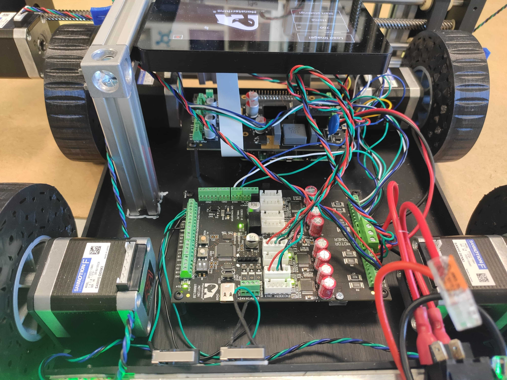
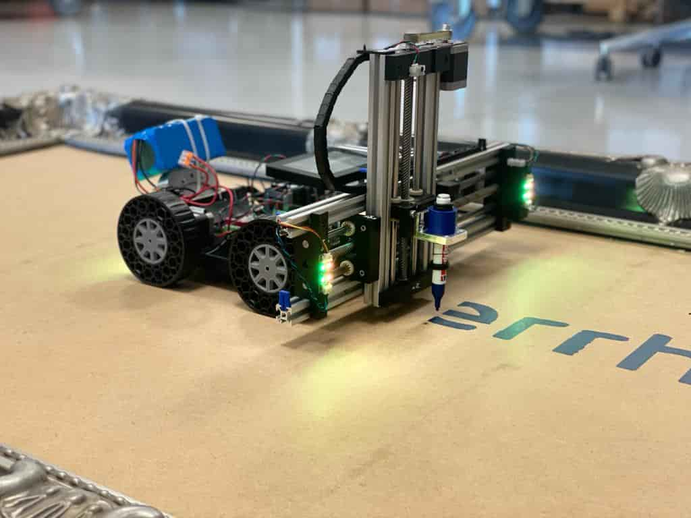

# MonsterrhinoPrinterCar

## Setup

#### Assemble the car as seen on the images:
  
  * Connect the MonsterrhinoMotion and MonsterrhinoControl to the 24V source (e.g. battery). Foresee a power switch at the 24V line. 
  * Connect the CAN between MonsterrhinoMotion and MonsterrhinoControl
  * Connect the display to the MonsterrhinoControl
  * Connect the limit switches to the inputs of motor 3 and 4 on the MonsterrhinoMotion
  * Connect the 4 Monsterrhino RGB LEDs to the MonsterrhinoControl
  * Connect the motors: motor 1 and motor 2 are the front wheels, motor 3 is the z axis, and motor 4 is the y axis

  <br><br>
  
  <br><br>

#### Setup the Raspberry Pi 4

* Download a pre-installed Raspberry Pi image with the already installed CAN and display driver as described here: https://github.com/Monsterrhino/MonsterrhinoControl 
* Download the Python3 GUI software (https://github.com/Monsterrhino/MonsterrhinoMotion/Projects/MonsterrhinoPrinterCar/python3) to the Raspberry Pi. You need to install some extra Python packages:

```Python
sudo python3 led.py 
sudo pip3 install pillow
sudo apt-get install python3-pil python3-pil.imagetk
sudo apt-get install python3-opencv
sudo apt-get install libhdf5-dev
sudo apt-get install libhdf5-serial-dev
sudo apt-get install libatlas-base-dev
sudo apt-get install libjasper-dev 
sudo apt-get install libqtgui4 
sudo apt-get install libqt4-test
sudo pip3 install numpy

```

Now you should be able to run the software by executing following command in a terminal:

```Python
sudo python3 MonsterrhinoPrinterCarGUI.py
```

#### Setup the MonsterrhinoMotion

* Open the **Monsterrhinostep-Lib** through your ArduinoIDE (File->Examples->Monsterrhinostep->monsterrhinostep) and copy the content of the three files in https://github.com/Monsterrhino/MonsterrhinoMotion/Projects/MonsterrhinoPrinterCar/firmaware to the according files of the Monsterrhinostep-Lib (**monsterrhinostep, User_Function1 and User_Function2**).

* Compile and upload to your MonsterrhinoControl (further information of how to do that can be found in the docs) - and thats it!

#### Print
Place the .jpg file you whant to print on the Raspberry Pi, from the GUI select **Load Image!** and search for the path to the image file. After selecting the image you should see a preview of it on the screen. Tab home for homing the y-z axis. After homing has finished press **Start plotting**.


#### **Attention:** Adjust settings
If you have a different length of the rails, different tires, the motor mounted differently or a different gear ratio on the axis you have to adjust some parameters:

Change the following lines in User_Function1 in the function **Homing3and4** to adjust the range of your y and z axis: 

```C++
	// y axis
	g_Motor4.SetMoveRelative(-1550);  // this is the maximum that the y axis can move in steps

	// x axis
	g_Motor3.SetMoveRelative(-850);   // this is the maximum that the z axis can move in steps
```

If the one motor spinns in the wrong direction you can use the USB commands within a serial monitor to fix that. To do so connect via serial monitor to your MonsterrhinoMotion card and type ``` m1st ?``` (change the number acording to the motor you need). You will see following output:

```C++
Get Startup: 
  drvStrength(drs): 0
  bbmTime(bt): 8
  bbmClks(bc): 0
  SenseResistor(sr): 220
  MotorCurrent(mA): 20
  MotorCurrentReduction(mAr): 20
  Freewheeling(fwm): 0
  Iholddelay(ihd): 7
  PwmOfsInitial(poi): 150
  PwmGradInitial(pgi): 30
  StepperDirection(sd): 0
  MotorSteps(mst): 200
  PWMThrs(pt): 0.00
  COOLThrs(ct): 0.00
  HighThrs(ht): 0.00
  SWMode(swm): 0
  RampMode(rm): 0
  RampMaxSpeed(ms): 200.00
  RampSpeedsStart(rms): 0.00
  RampSpeedsStop(rmt): 0.10
  RampSpeedsHold(rmh): 100.00
  AccelerationsAMax(AMax): 250.00
  AccelerationsDMax(DMax): 350.00
  AccelerationsA1(A1): 500.00
  AccelerationsD1(D1): 700.00
  CoolConf(CC): 0
  EncoderResolution(er): 0
  EncoderAlloweddeviation(ead): 0
  EncoderSetup(es): 0
  EncoderInverted(ei): 0
  HomingMode(hm): 0
  HomingOffset(ho): 0.00
  HomingMaxPos(hp): 1000000
  HomingTimeout(ht): 100000
  HomingSpeed_2(hs2): 10.00
  HomingDmax(hd): 2100.00
```
Now you can change the parameter **StepperDirection(sd): 0 ** to the opposite direction by entering ``` m1st sd 1``` into the terminal. Save the changes by typing ``` m1smp```.

It might also be necessary to change the motor currents, depending on the motors and mechanics you use. You can do so by changing the values of this lines (e.g. motor 4):

```C++
		g_Motor4.SetMotorCurrent(100);
		g_Motor4.SetMotorCurrentHold(10);
```

**Have fun!**
  <br><br>
  
  <br><br>

