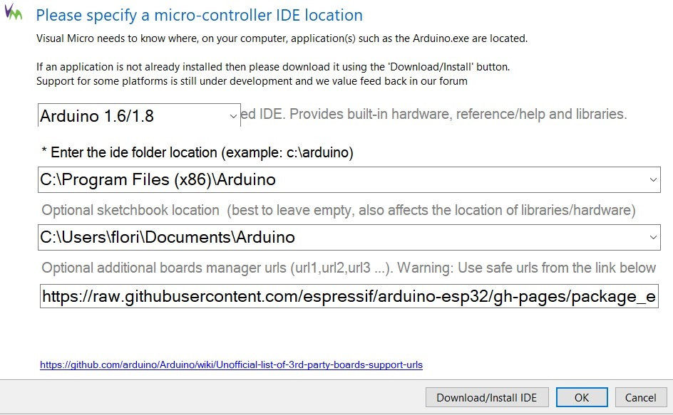

# Get started

## Monsterrhino installation guide

## Install Java Runtime Environment

### For Windows
* download the Java Runtime Environment from the official Website - https://www.java.com/en/download/manual.jsp (or get it from the Software folder)
* install it by running the executable (.exe) file


### For Ubuntu
* install the Java Runtime Environment by executing the following command in your terminal: ```sudo apt install openjdk-8-jre```


## Prepare Arduino IDE:
* Download and install the Arduino IDE from the official page: https://www.arduino.cc/en/Main/Software (or get it from the Software folder)

* Start the Arduino IDE and add **Stm32duino** to it by doing the following steps:
  + add the following line under **File->Preferences** in the section **Additional Boards Manager URLs**: `https://raw.githubusercontent.com/stm32duino/BoardManagerFiles/master/STM32/package_stm_index.json`  
  + go to **Tools->Board->Boards Manager** and search for **STM32 Cores**, choose version **1.8.0** and press *Install*  


## Install STM32CubeProgrammer:
  
* Download **STM32CubeProgrammer** from the official page: https://www.st.com/en/development-tools/stm32cubeprog.html (or get it from the Software folder)

  ### For Windows
  * install it by running the executable (.exe) file
  
  ### For Ubuntu
  * using Ubuntu the **STM32CubeProgrammer** can be installed by executing the install script from a terminal - *cd* to the location of the file, then run it: ```./SetupSTM32CubeProgrammer-2.5.0.linux```
  
  ### For both
  * you can install it using the default settings; during the installation process, also complete the driver installation that will pop up


## Add the Monsterrhino application to the Arduino IDE:

* open Arduino IDE, for each libary inside the Libs folder go to **Sketch->IncludeLibrary->Add .ZIP Library ..** and select it
* open the Monsterrhino application in your Arduino IDE: **File->Examples->MonsterrhinoStep**
* adjust the Arduino IDE tool settings (**Tools**) like follows
  + Board: "Nucleo-64" (**Tools -> Board .. -> STM32 Boards -> Nucleo-64**)
  + Board part number: "Nucleo L476RG"
  + USB support (if available): "CDC (generic 'Serial' supersede U(S)ART-)"
  + Upload method: "STM32CubeProgrammer (DFU)"  
  
* replace the files on your computer with the files you find inside the **ToReplace** folder
  + **usbd_cdc_if.c**:  
  "C:\\Users\\*username*\\AppData\\Local\\Arduino15\\packages\\STM32\\hardware\\stm32\\1.8.0\\cores\\arduino\\stm32\\usb\\cdc"
  + **variant.c**:  
  "C:\\Users\\*username*\\AppData\\Local\\Arduino15\\packages\\STM32\\hardware\\stm32\\1.8.0\\variants\\NUCLEO_L476RG"
  + **monsterrhinoStep**-Folder:  
  "\\Users\\*username*\\Documents\\Arduino\\libraries"


## Use Monsterrhino directly in your Arduino IDE
* once Monsterrhino is connected to your computer and the reset button on it is pushed, the system should recognize your USB device
* now choose the correct Port **Settings -> Port** inside the Arduino IDE
* open the serial monitor **Settings -> Serial monitor**, set Baud to **115200**, set line endings to **NL and CR**
* you can now send commands to your Monsterrhino using the serial monitor


## Upload the Monsterrhino application to your Monsterrhino
  
### For Ubuntu
*change the #include arduino.h to #include Arduino.h in all the header files of the MonsterrhinoStep library
  
### For both
* connect your computer to your Monsterrhino, push the reset button while holding down the debug button on your Monsterrhino
* compile and upload the Monsterrhino application using your Arduino IDE


# Set up Visual Studio to use with Monsterrhino
* the above setup of Arduino IDE has to be completed before setting up Visual Studio
* download and install Visual Studio (or get it from the Software folder), add the workload **desktop development with c++** during the installation process  https://docs.microsoft.com/en-us/visualstudio/install/install-visual-studio?view=vs-2019, you may skip the registering process as it is optional
* install Arduino Extension in Visual Studio: go to **Extension -> ManageExtensions -> Online**, search for **Arduino** and install **Arduino IDE for Visual Studio (Visual Micro)** (you will have to close Visual Studio during the installation process)
* open the location configuration **Extensions -> vMicro -> General -> Configure Arduino IDE Location(s)** and enter the correct paths, it should look similar to the example in the image:  

  {width=50%}  

* open project **monsterrhinostep** (/Documents/Arduino/monsterrhinostep.sln) in Visual Studio
* adjust the vMicro settings (**Extensions -> vMicro**) to the same values as you did in your Arduino IDE (see **adjust the Arduino IDE settings like follows** above)
* reopen Visual Studio, open **Extensions -> vMicro -> ViewPortMonitor ** (Monsterrhino needs to be connected to your computer to be able to open it), switch the setting **line endings** to **Both CR & LF**
* you can now use the ViewPortMonitor to connect to your Monsterrhino and directly send commands 
* to use Visual Studio to compile and upload your code to your Monsterrhino, you first have to restart it in debug mode (keep debug button pushed while pressing the reset button)


# Commands

Description |shortcut1|shortcut2
------------|---------|--------
Motor       |**m**    |**motor**
Input       |**i**    |**input**
Function    |**f**    |**function**


Description |shortcut1|shortcut2
------------|---------|--------
TargetPosition |tp|targetpos
CurrentPosition|cp|currentpos
Mode|mo|mode
MaxSpeed|ms|maxspeed
CurrentSpeed|cs|currentspeed
Register|r|register
RampSpeeds|rs|rampspeeds
Acceleration|ac|acceleration
Accelerations|as|accelerations
Stop|s|stop
Enable|en|enable
Disable|di|disable
EncoderPosition|ep|encoderposition 
LatchedPosition|lp|latchedposition
LatchedEncoderPosition|le|latchedencoder
MotorDriveStatus|mds|motordrvstatus
MotorRampStat|mrs|motorrampstat
gStat|gs|gstat
MotorCurrent|ma|currentma
Freewheelingmode|fwm| freewheelingmode
ModeChangeSpeeds|mcs| modechangespeeds
Switch Mode|swm|swmode
Save|sv|save
SaveMotorParameter|smp|savemotorparameter
Test|test
Load|ld|load
Startup|st|startup
**Input**|i|input
InputFunction|if|inputfunction
StartUp|st|startup
**Functions**|f|function:
Start|s|start
Stop|t|stop
Variable|v|variable
Float|f|float
Startup|st|startup
Unlock|u|unlook

Mode|mo|mode ->
	? (get) 
	p or positioning 
	v or velocity
	h or hold

# Questions:
* pUserFunction->m_MotorIoEvent.SetOrCondition(MOTORIOEVENT_MOTOR4PosReached); ??
* How to wait for motor move to finish? while (g_Motor1.getCurrentPosition() != pos); Better way?
* Homing with serial command?
* What is latched ?
* Look or Lock ?
* Possible to see if endswitch is activated
* How to use Homing function?
* Hoe to call userfunction from other userfunction?

# Change on hardware:
* Emergeny poweroff off motors with Raspberry Pin and with Emergeny Poweroff button
* 3.3 V instead of 5 V on the limit switch supply
* LED for endswitch if possible
* LED power indicator on both boards
* Boot mode switch instead of jumper (next to each other)
* Rename sensors to inputs (and RGB as analog out) and outputs abc or 123...
* Make solder mask black with Monsterrhino logo
* TxRx indicator LED for CAN (maybe both)
* Motor board label CAN in and CAN out (or is it commutable)
* Add 10k pullup on RESET pin of MCP2515 CAN chip
* Connect **CS Pin** of MCP2515 to **SPI_CE1_N** instead of **SPI_CE0_N** because 0 is used by the display, or make a switch to choose between them


# To do firmware:
* Start all motor and sensor names with 0
* Use CAN address switch for selecting relevant part of firmware
* Implement CAN Bus
* Implement LOCK and FAN input/outputs
* Encoder implementation
* Force sensing implementation
* "Run smooth" function implementation
* Read value sense resistor