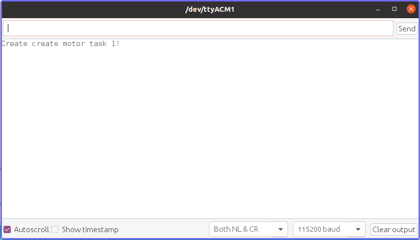

# MonsterrhinoMotion

## Introduction
The MonsterrhinoMotion card is an independent stepper motor driver card to power and control up to 4 stepper motors that comes with a pre-installed firmware. The MonsterrhinoMotion card uses high quality stepper drivers (TMC5160) from Trinamic.
You can use Monsterrhino Motion in different ways depending on the complexity of your project: 

- Use the pre-installed library by sending commands **over a serial USB port** using a variety of predefined functions (see below)
- Use the pre-installed library by sending commands **over CAN bus** using a variety of predefined functions (see in the MonsterrhinoControl documentation)
- Program functions and actions with the **provided Arduino library** and upload directly to the card

In the simplest case all you need to do is **just connect 24V, a stepper motor and a USB cable** to the Monsterrhino Motion and you are ready to move the motor - **plug and play**.

The key features of the MonsterrhinoMotion stepper driver card are:

- up to 4 stepper motors
- two limit switches per motor
- encoder for each stepper motor
- up 12 digital inputs (24V)
- 1 digital output (24V)
- 3 PWM outputs (open collector)
- 2 CAN bus connector 
- USB C connector
- micro USB connector
- analog emergency power-off circuit that can be bridged with a jumper


## MonsterrhinoMotion pinout


## USB serial communication

### Connect to Monsterrhino Motion

Install the Arduino IDE on your computer (https://www.arduino.cc/en/software). Open the Arduino IDE on your computer. 

+ Select the right port under **Tools->Port** e.g. /dev/ttyACM0 or COM5. 
+ Open the serial monitor and set **115200 baud** and line ending to **Both NL & CR**. 

  <br><br>
   
  <br><br>


Press the reset button on the Monsterrhino Motion than your ready to type your first command. If you have Motor 1 connected you can for example type: **m1mr 100** into the serial monitor and hit enter - now Motor 1 should move 1000 steps (that is 5 rotations - 200 steps per rotation or 1.8° per step). The meaning of this command is: **m1** - motor 1, **mr** move relative, **1000** - hundred steps. With **m1mr -1000** you can move 1000 steps into the other direction. 

[](http://www.youtube.com/watch?v=Wm-6o_nRb1g "Serial communication")

### Commands
The MonsterrhinoMotion commands are combinations of commands from the list below. They are composed of the classifier: **m, i or f**. A number after the classifier letter selects the desired motor, input, or function: Motor 1 = **m1**, Userfunction 1 = **f1**. The classifier is followed by a function such as targetposition = **tp** and a number.

- **m1tp 100** - motor 1 move to target position 100
- **m4ma 200** - motor 4 set motor current to 200 mA
- **m3smp** - motor 3 save motor parameters
- **m2cp ?** - request motor 2 current position

The questionmark can generally be used to request a current value e.g. Motor 1 what is the current position = **m1tp ?**.

Motor |**m**    |**motor** | Setting
---         | :-:     | :-: | :-:
TargetPosition |tp|targetpos |
CurrentPosition|cp|currentpos|
Rampmode|rm|rampmode |	p or positioning, v or velocity, h or hold
Motor current|ma|currentma |
MaxSpeed|ms|maxspeed |
CurrentSpeed|cs|currentspeed|
Register|r|register|
RampSpeeds|rs|rampspeeds|
Acceleration|ac|acceleration|
Accelerations|as|accelerations|
Stop|s|stop|
Enable|en|enable|
Disable|di|disable|
EncoderPosition|ep|encoderposition |
LatchedPosition|lp|latchedposition|
LatchedEncoderPosition|le|latchedencoder|
MotorDriveStatus|mds|motordrvstatus|
MotorRampStat|mrs|motorrampstat|
gStat|gs|gstat|
MotorCurrent|ma|currentma|
Freewheelingmode|fwm| freewheelingmode|
ModeChangeSpeeds|mcs| modechangespeeds|
Switch Mode|swm|swmode|
Save|sv|save|
SaveMotorParameter|smp|savemotorparameter|
Test|test|
Load|ld|load|
Startup|st|startup |

**Input**|i|input
---         | :-:     | :-:
InputFunction|if|inputfunction
StartUp|st|startup

**Functions**|f|function
---         | :-:     | :-:
Start|s|start
Stop|t|stop
Variable|v|variable
Float|f|float
Startup|st|startup
Unlock|u|unlook


## Program the **Monsterrhinostep library** with Arduino IDE or VisualMicro

To use the the Monsterrhinosteb-Lib (https://github.com/Monsterrhino/MonsterrhinoMotion/tree/master/Library) library it is necessary to install following packages first:

## On Windows
Tested on Windows 10.

### Install Java Runtime Environment
If not already satisfied:

* Download the Java Runtime Environment from the official Website - https://www.java.com/en/download/manual.jsp 
* Install it by running the executable (.exe) file

### Prepare Arduino IDE:
* Download and install the Arduino IDE from the official page: https://www.arduino.cc/en/Main/Software (or get it from the Software folder)

* Start the Arduino IDE and add **Stm32duino** as follows:
  + Go to **File->Preferences**. Under the section **Additional Boards Manager URLs**:
    
  
       ```https://raw.githubusercontent.com/stm32duino/BoardManagerFiles/master/STM32/package_stm_index.json  ```
       
  <br><br>
       
  <br><br>
  
  + Go to **Tools->Board->Boards Manager** and search for **STM32 Cores**, choose version **1.8.0** and press *Install*. 
  
  <br><br>
      
  <br><br>
  
  After that you should be able to select **Nucleo-64** under **Tools->Board**. 

  <br><br>
   
  <br><br>
  
### Install STM32CubeProgrammer:
  
* Download **STM32CubeProgrammer** from the official page: https://www.st.com/en/development-tools/stm32cubeprog.html. You need to enter your email address for that. 
* Install it by running the executable (.exe) file.
* You can install it with the default settings. During the installation process, the drivers will be installed to.
* Verify the installation by opening the programm **STM32CubeProgrammer**. If the program opens normally, everything should be fine.

-----------------------------------------------------------------
**_Attention_:**
Check if you can open the **STM32CubeProgrammer** and connect to your MonsterrhinoMotion. Select USB and **bring your MonsterrhinoMotion into boot-mode** by pressing reset while holding down the boot button. After successfully connecting to your device you should see something similar to:


  <br><br>
   
  <br><br>


### Following files need to be replaced inside the Arduino folder
Replace following two files on your computer with the files you find inside the https://github.com/Monsterrhino/MonsterrhinoMotion/tree/master/Library/Replace folder:


  + Replace **usbd_cdc_if.c** inside:  
  ```C:\Users\username\AppData\Local\Arduino15\packages\STM32\hardware\stm32\1.8.0\cores\arduino\stm32\usb\cdc```
  **or**
  ```C:\Users\username\Documents\ArduinoData\packages\STM32\hardware\stm32\1.9.0\cores\arduino\stm32\usb\cdc ```
   **-** depending on location of your installation (it could also be a different location). 
  
  + Replace **variant.c** inside:  
  ```C:\Users\username\AppData\Local\Arduino15\packages\STM32\hardware\stm32\1.8.0\variants\NUCLEO_L476RG ``` 
  **or**
  ```C:\Users\username\Documents\ArduinoData\packages\STM32\hardware\stm32\1.8.0\variants\NUCLEO_L476RG ```
   **-** depending on location of your installation (it could also be a different location). 

### Add the **STM32duino_FreeRTOS.zip** to the Arduino IDE:
The **STM32duino_FreeRTOS.zip** can be found here: https://github.com/Monsterrhino/MonsterrhinoMotion/tree/master/Library. Download it and add **STM32duino_FreeRTOS.zip** to the Arduino IDE libraries from the menu **Sketch->Include Library->Add ZIP Library**.
  
### Add the **MonsterrhinoStep-Lib** to the Arduino IDE:
To add the **MonsterrhinoStep-Lib** to the Arduino IDE download the **MonsterrhinoStep-Lib.zip** from https://github.com/Monsterrhino/MonsterrhinoMotion/tree/master/Library and proceed with following steps:

* Open the Arduino IDE, for each libary inside the Libs folder go to **Sketch->IncludeLibrary->Add .ZIP Library ..** and select the **MonsterrhinoStep-Lib.zip** file.
* Open the Monsterrhino application in your Arduino IDE: **File->Examples->Monsterrhinostep->monsterrhinostep**.
  
  <br><br>
   
  <br><br>
  
  Now you should see following files in the Arduino IDE: **monsterrhinostep**, **User_Functions1.cpp**, **User_Functions2.cpp**, **User_Functions3.cpp**, **User_Functions4.cpp**, **User_Functions5.cpp**, **User_Functions6.cpp**, **build_opt.h**.
  
  <br><br>
   
  <br><br>
  
* Before you can start you need to adjust some settings in the Arduino IDE under **Tools**:
  + Board: "Nucleo-64" **Tools -> Board .. -> STM32 Boards -> Nucleo-64**
  + Board part number: **Nucleo L476RG**
  + USB support (if available): **CDC (generic 'Serial' supersede U(S)ART-)**
  + Upload method: **STM32CubeProgrammer (DFU)** 
  
  <br><br>
   
  <br><br>
  

### Upload your MonsterrhinoMostion application to your MonsterrhinoMotion card
  
For uploading a program, connect your computer to your MonsterrhinoMotion card via micro USB or USB C, push the reset button while holding down the debug button on your MonsterrhinoMotion card. You will hear the Windows USB connection sound twice. After successfully entering **boot mode** the debug LED will stop blinking.
Now you can hit the compile and upload button to upload the MonsterrhinoMotion application to the card. After the upload press the **reset button**.


### Set up Visual Studio to use with Monsterrhino
The setup of Arduino IDE shown before has to be completed prior to setting up Visual Studio.

* Download and install Visual Studio (https://docs.microsoft.com/en-us/visualstudio/install/install-visual-studio?view=vs-2019), add the workload **desktop development with c++** during the installation process. 
* Install Arduino Extension in Visual Studio: go to **Extension -> ManageExtensions -> Online**, search for **Arduino** and install **Arduino IDE for Visual Studio (Visual Micro)** (you will have to close Visual Studio during the installation process).
* Open the location configuration **Extensions -> vMicro -> General -> Configure Arduino IDE Location(s)** and enter the correct paths, it should look similar to the example in the image:  

<br><br>
{width=50%}  
<br><br>

* Open VisualStudio and press **Continue without code** and then go to **File->Open->Arduino Project** and navigate to ```..\Arduino\libraries\Monsterrhinostep-Lib\examples\monsterrhinostep\monsterrhino.ino```
* Adjust the vMicro settings (**Extensions -> vMicro**) to the same values as you did in your Arduino IDE (see **adjust the Arduino IDE settings like follows** above)
* Open Visual Studio, open **Extensions -> vMicro -> ViewPortMonitor ** (Monsterrhino needs to be connected to your computer to be able to open it), switch the setting **line endings** to **Both CR & LF**
* You can now use the ViewPortMonitor to connect to your Monsterrhino and directly send commands 
* To use Visual Studio to compile and upload your code to your Monsterrhino, you first have to restart it in debug mode (keep debug button pushed while pressing the reset button)


## On Ubuntu 
Tested on Ubuntu 20.04. 

* Install the Arduino IDE (tested with version 1.8.12)
* In the Arduino IDE go to **Properties/Additional BoardsManager** and add following 

  ```https://github.com/stm32duino/BoardManagerFiles/raw/master/STM32/package_stm_index.json ```
  
* Under **Arduino/Boardsmanager** add ```stm32 cores```.
* Install the Java Runtime Environment by executing the following command in your terminal ```sudo apt install openjdk-8-jre```.
* Download and install the **STM32CubeProgrammer**. There might be problems with JavaFX, you can try this fix https://askubuntu.com/a/1316213.


  **Attention**
  Check if you can open the **STM32CubeProgrammer** and connect to your MonsterrhinoMotion. Select USB and bring your MonsterrhinoMotion into boot-mode by pressing reset while holding down the boot button. It might be usefull to open the **STM32CubeProgrammer** via the terminal, so you get some information if something is not right.
  
  **Note**
  If in your terminal you read something about **permission denied** it might be necessary to copy a rules.d file to the STM32 folder. To do so you can follow this instructions (taken from: https://community.st.com/s/question/0D53W000000aP9J/no-stm32-device-in-dfu-mode-connected): 
  
  * Make sure you have installed this library: ```sudo apt-get install libusb-1.0-0```
  * To allow STM32CubeProgrammer to access the USB port through low-level commands, proceed as follows: 
  ```cd $HOME/STM32MPU_workspace/STM32MPU-Tools/STM32CubeProgrammer-x.y.z/Drivers/rules```
  * Then execute: ```sudo cp *.* /etc/udev/rules.d/```
  * Restart the STM32CubeProgrammer 
  
  **After successfully connecting** to your device you should see something similar to:
  
    <br><br>
     
    <br><br>
    

* Replace following two files on your computer with the files you find inside the https://github.com/Monsterrhino/MonsterrhinoMotion/tree/master/Library/Replace     folder:

  + Replace **usbd_cdc_if.c** inside:  
  ``` /home/g/.arduino15/packages/STM32/hardware/stm32/1.8.0/cores/arduino/stm32/usb/cdc ```
  + Replace **variant.c** inside:  
  ``` /home/g/.arduino15/packages/STM32/hardware/stm32/1.8.0/variants/NUCLEO_L476RG ```
  
  * Add **Monsterrhinostep-Lib.zip** and **STM32duino_FreeRTOS.zip** to the Arduino IDE libraries from the menu **Sketch->Include Library->Add ZIP Library**.

* If you whant to use a **STM32nucleo** to program over **ST-Link** it might be necessary to give permission to the USB device (as described here: https://stackoverflow.com/questions/22713834/libusb-cannot-open-usb-device-permission-isse-netbeans-ubuntu): 
 ``` sudo chmod o+w /dev/bus/usb/123/456 ```

  